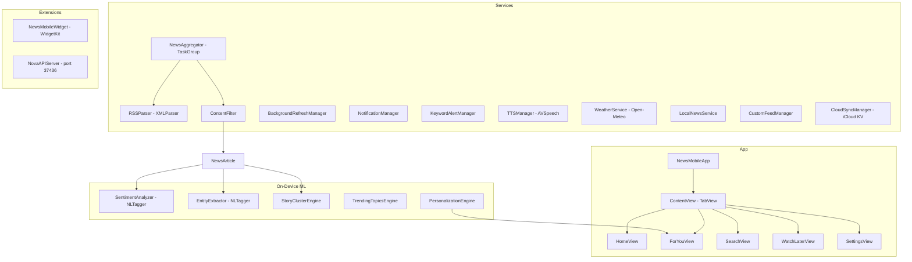

# NewsMobile

**On-device ML news reader for iPhone and iPad**


[](https://opensource.org/licenses/MIT)


A native SwiftUI news aggregator that runs sentiment analysis, named entity recognition, story clustering, and personalized feed ranking entirely on-device using Apple's NaturalLanguage framework. Pulls from 16 built-in RSS sources across 10 categories, filters ads and clickbait, syncs state over iCloud, and includes a WidgetKit home screen extension. No cloud AI, no accounts, no telemetry.

---

## Architecture



---

## Features

| Category | Details |
|----------|---------|
| **Sentiment Analysis** | NLTagger `.sentimentScore` scores every headline as positive, neutral, or negative with color-coded indicators |
| **Named Entity Recognition** | NLTagger `.nameType` extracts people, organizations, and places from article titles |
| **Story Clustering** | Groups related articles from different sources by shared nouns and verbs; shows left/center/right perspective breakdown |
| **Trending Topics** | Named entity frequency + proper-noun counts surface the top 15 trending topics |
| **Personalization** | Tracks category, source, and entity preferences weighted by dwell time; 4-factor scoring model for the "For You" feed |
| **16 RSS Sources** | AP, Reuters, NPR, NY Times, BBC, The Guardian, CNBC, TechCrunch, Ars Technica, The Verge, Science Daily, ESPN, Variety, Politico, The Hill, Medical News Today |
| **Content Filtering** | Strips ads, sponsored content, clickbait patterns, and user-excluded sources |
| **Breaking News** | Headline keyword detection within the last hour; banner overlay |
| **Audio Briefings** | AVSpeechSynthesizer reads headlines with play/pause/skip controls and configurable speech rate |
| **WidgetKit** | Small, Medium, and Large widgets with headlines, sentiment dots, weather, and trending topic |
| **iCloud Sync** | NSUbiquitousKeyValueStore syncs settings and saved articles across devices |
| **Background Refresh** | BGAppRefreshTask every 15 minutes |
| **Push Notifications** | UNUserNotificationCenter for breaking news and keyword alerts |
| **Watch Later** | Bookmark queue with read/unread tracking |
| **Local News** | Google News RSS geo-search + 20 pre-populated US cities |
| **Weather** | Open-Meteo API via CoreLocation (free, no key) |
| **Custom Feeds** | Add unlimited RSS feeds through settings |
| **Local API** | NWListener on 127.0.0.1:37436 -- `/api/status`, `/api/ping` |

---

## News Sources

| Category | Sources | Bias |
|----------|---------|------|
| Top Stories | Associated Press, Reuters, NPR | Center, Center, Lean Left |
| US | NY Times | Lean Left |
| World | BBC, The Guardian | Center, Lean Left |
| Business | CNBC | Center |
| Technology | TechCrunch, Ars Technica, The Verge | Center |
| Science | Science Daily | Center |
| Health | Medical News Today | Center |
| Sports | ESPN | Center |
| Entertainment | Variety | Center |
| Politics | Politico, The Hill | Center |

---

## Requirements

- iOS 17.0 / iPadOS 17.0
- Xcode 15.0+ (build from source)
- iCloud account (optional, for sync)
- Location Services (optional, for local news and weather)

---

## Build

```bash
git clone git@github.com:kochj23/NewsMobile.git
cd NewsMobile
open NewsMobile.xcodeproj
# Select device or simulator, Cmd+R
```

Zero external dependencies. Uses only Apple first-party frameworks: SwiftUI, NaturalLanguage, BackgroundTasks, Network, AVFoundation, CoreLocation, WidgetKit.

---

## Test Suite

85 XCTest cases covering models, ML, services, and security.

| Category | Tests | Description |
|----------|-------|-------------|
| NewsArticle Model | 11 | Creation, equality, hashing, Codable, breaking flag, timeAgo, URL scheme, mutability |
| NewsCategory | 7 | All cases, icons, colors, identifiable, Codable, raw values |
| SourceBias | 4 | Colors, length, Codable round-trips |
| NewsSource | 5 | Creation, hashability, Codable, URL scheme, defaults |
| SentimentResult | 5 | Positive/negative/neutral, icons, Codable |
| ExtractedEntity | 3 | Creation, types, Codable |
| StoryCluster | 1 | Multi-source grouping |
| WatchLater | 2 | Creation, Codable |
| KeywordAlert | 2 | Defaults, Codable |
| Settings | 4 | Defaults, speech rates, font sizes, Codable |
| UserPreference | 2 | Default profile, Codable |
| Security | 5 | No hardcoded keys, HTML sanitization, URL schemes, Codable leaks |
| **Total** | **85** | |

```bash
xcodebuild test -scheme NewsMobile -sdk iphonesimulator \
  -destination "platform=iOS Simulator,name=iPhone 16"
```

---

## Project Structure

```
NewsMobile/
  NewsMobileApp.swift               -- @main entry, background task registration
  ContentView.swift                 -- Root TabView with breaking news overlay
  NovaAPIServer.swift               -- Local HTTP API (port 37436)
  ML/
    SentimentAnalyzer.swift         -- NLTagger sentiment scoring
    EntityExtractor.swift           -- Named entity recognition
  Models/
    NewsModels.swift                -- Data models and enums
    AIBackendManager.swift          -- Local AI backend detection
  Services/
    NewsAggregator.swift            -- Concurrent RSS fetch engine
    RSSParser.swift                 -- XMLParser RSS/Atom decoder
    PersonalizationEngine.swift     -- Reading habit personalization
    StoryClusterEngine.swift        -- Multi-source story grouping
    TrendingTopicsEngine.swift      -- Topic frequency analysis
    ContentFilter.swift             -- Ad and clickbait filtering
    CloudSyncManager.swift          -- iCloud KV sync
    BackgroundRefreshManager.swift  -- BGAppRefreshTask scheduling
    NotificationManager.swift       -- Push notifications
    KeywordAlertManager.swift       -- Keyword monitoring
    TTSManager.swift                -- Text-to-speech briefings
    WeatherService.swift            -- Open-Meteo weather
    LocalNewsService.swift          -- Geo-local news
    CustomFeedManager.swift         -- User-added RSS feeds
    WatchLaterManager.swift         -- Save-for-later queue
    WidgetDataManager.swift         -- App Group data for widgets
    SettingsManager.swift           -- Settings persistence
  Views/
    HomeView, ForYouView, SearchView, WatchLaterView, SettingsView,
    ArticleDetailView, ArticleWebView, AudioBriefingView, CategoryView,
    CustomFeedsView, KeywordAlertsView, LocalNewsView, StoryClusterView
    Components/
      ArticleCard, BreakingNewsBanner, TrendingBar, WeatherWidget
NewsMobileWidget/
  NewsMobileWidget.swift            -- WidgetKit extension (S/M/L)
```

---

## Privacy and Security

- All ML runs on-device. No data sent to cloud AI services.
- No analytics, telemetry, or tracking. No sign-in required.
- RSS fetched directly from public feeds. No intermediary servers.
- No API keys or credentials required or stored.
- Local API binds to loopback only (127.0.0.1).

---

## Related Projects

- [NewsTV](https://github.com/kochj23/NewsTV) -- Apple TV version

---

## License

MIT License. See [LICENSE](LICENSE).

Copyright (c) 2026 Jordan Koch.

---

Written by **Jordan Koch** ([@kochj23](https://github.com/kochj23))
